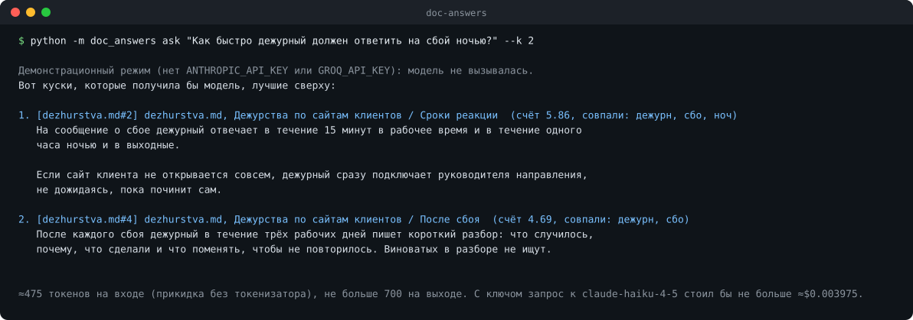

# doc-answers

[](https://github.com/maarshir/doc-answers/actions/workflows/tests.yml)



<sub>Настоящий вывод без ключа: видно, какие куски нашлись и по каким словам.</sub>

Правила и памятки команды лежат в десятке файлов, и искать в них никто не хочет. doc-answers находит нужные куски и просит модель ответить строго по ним, со ссылкой на источник после каждого факта. Если ответа в документах нет, программа так и говорит, а не сочиняет.

## Как запустить

```bash
git clone https://github.com/maarshir/doc-answers && cd doc-answers
pip install -r requirements.txt
cp .env.example .env   # ключ Groq или Anthropic; без ключа работает демонстрационный режим
python -m doc_answers ask "Сколько дней отпуска в году?"
python -m doc_answers ask "Что делать, если сломался ноутбук?" --docs путь/к/своей/папке
```

Нужен Python 3.10+. Читает `.md`, `.txt` и `.pdf` с текстовым слоем, битый файл не роняет всё, а попадает в предупреждения. Ключ Groq бесплатный: [console.groq.com/keys](https://console.groq.com/keys). Документы в `examples/docs` это вымышленная памятка вымышленной студии.

## Как проверяется качество

Ответ ломается в двух местах, и проверяются они отдельно.

**Поиск**, без модели и бесплатно: `python -m doc_answers search-eval` прогоняет 15 вопросов из `eval/questions.yaml`. Сейчас кусок с ответом стоит первым в 12 из 12 вопросов. Примеры маленькие, так что это значит только «ничего не сломано».

**Ответы модели**: `python -m doc_answers export-promptdiff` выгружает те же вопросы в [promptdiff](https://github.com/maarshir/promptdiff-), где сравниваются промпт с правилами и промпт без них.

## Что было непросто

- **Куда резать текст.** Маленький кусок теряет смысл, большой вытесняет соседей. Резка идёт по заголовкам, абзацам и предложениям, перекрытие только целыми предложениями.
- **Модели нельзя верить на слово про источники.** После ответа код сверяет каждую ссылку со списком кусков, которые модель реально получила.
- **Отказ должен быть узнаваемым.** Модель отвечает одной заранее заданной фразой, иначе программа не отличит «не знаю» от ответа.
- **Не звать модель зря.** Если в документах нет ни одного слова из вопроса, запрос не отправляется.

Почему BM25, а не векторный поиск, и остальные решения: [docs/решения.md](docs/решения.md).

## Что дальше

- Набор вопросов потруднее: синонимы, ответ на границе кусков, вопрос из двух частей.
- Цитата под каждым утверждением, а не только файл и раздел.
- Индекс на диске для больших папок.

100 тестов, сеть в них подменена, ключ не нужен. Цена каждого запроса считается через [token-counter](https://github.com/maarshir/token-counter).
